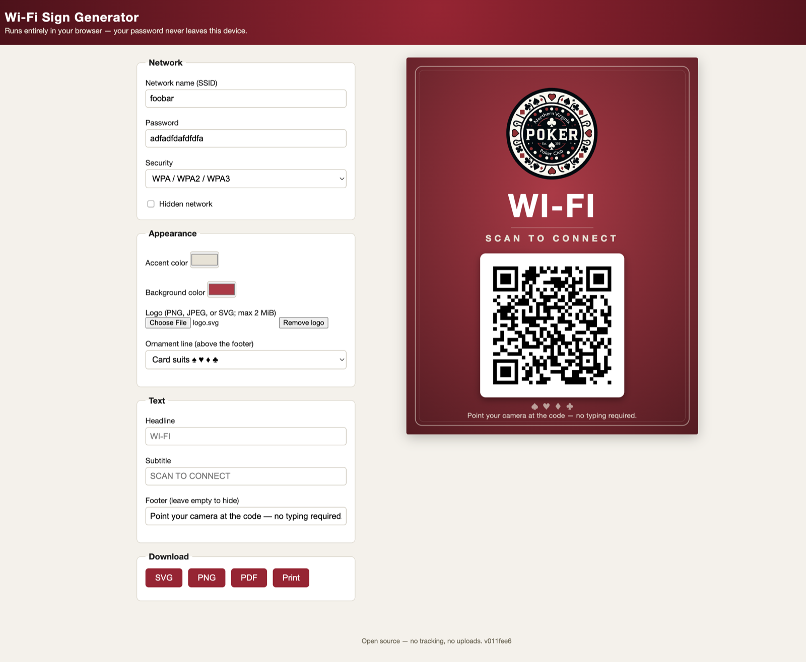

# qr-codes

QR code tooling in Go: a CLI for encoding/decoding QR codes and a
client-side webapp that generates printable Wi-Fi signs.

## Wi-Fi Sign Generator — [wifi-signs.grocky.net](https://wifi-signs.grocky.net)

**Give your guests Wi-Fi without spelling out the password.** Type your
network details, watch the sign update live, and download a print-ready
8.5×11in poster — guests just point their camera and they're on.

[](https://wifi-signs.grocky.net)

- **Private by design** — the whole app runs in your browser (Go compiled
  to WebAssembly). Your password never leaves the device; there's no
  backend to send it to.
- **Make it yours** — pick accent and background colors, upload your own
  logo, rewrite every line of text, and choose the ornament flourish
  (card suits, a custom tagline, or none).
- **Print-ready output** — crisp vector SVG, 300dpi PNG, or US Letter
  PDF. The QR code is generated as vector paths, so it stays sharp at
  any size.
- **Free and open source** — no tracking, no uploads, no account.

Design details in [docs/TDD-wifi-signs.md](docs/TDD-wifi-signs.md).

```sh
make serve       # build WASM and serve web/ on :8080
make test        # Go unit tests
make e2e         # Playwright smoke tests (needs: cd web/e2e && npm install)
make deploy      # wrangler pages deploy web (Cloudflare Pages)
```

### Infrastructure

`infrastructure/` manages the Cloudflare Pages project and the proxied
`wifi-signs.grocky.net` CNAME in the Cloudflare `grocky.net` zone (DNS
migrated from Route53 — see the minecraft repo's
`docs/runbook-cloudflare.md` for the account/zone/token bootstrap). State
lives in `s3://grocky-tfstate/wifi-signs.grocky.net/terraform.tfstate`
with S3-native locking (AWS credentials needed for state only).

```sh
cp infrastructure/terraform.tfvars.example infrastructure/terraform.tfvars
# fill in the API token + account/zone IDs (same IDs as the minecraft repo)
make tf-init tf-plan tf-apply
make deploy                       # then publish web/ to the Pages project
```

## CLI

```sh
go build -o qr-codes ./cmd/qr-codes

qr-codes encode url [-o out.png] https://example.com
qr-codes encode wifi -ssid "my net" -password s3cret [-auth WPA|WEP|nopass]
qr-codes decode image.png [more.png ...]
qr-codes sign -ssid "my net" -password s3cret [-logo logo.png] [-o sign.svg]
```

`encode` writes QR code images (halftone and transparent background
supported), `decode` reads them back, and `sign` renders the same Wi-Fi
sign SVG as the webapp — handy for scripting and for previewing template
changes natively.

## Layout

- `cmd/qr-codes` — CLI (encode / decode / sign)
- `cmd/wasm` — browser glue exposing `wifiSign.render` (build with `make build-wasm`)
- `internal/payload` — Wi-Fi/URL QR payload strings
- `internal/sign` — sign parameters, validation, QR path, SVG template rendering
- `internal/encoder`, `internal/decoder` — raster QR encode/decode (CLI only)
- `web/` — the static site deployed to Cloudflare Pages
