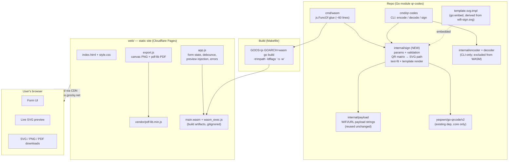
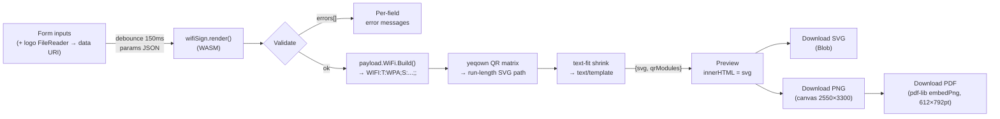
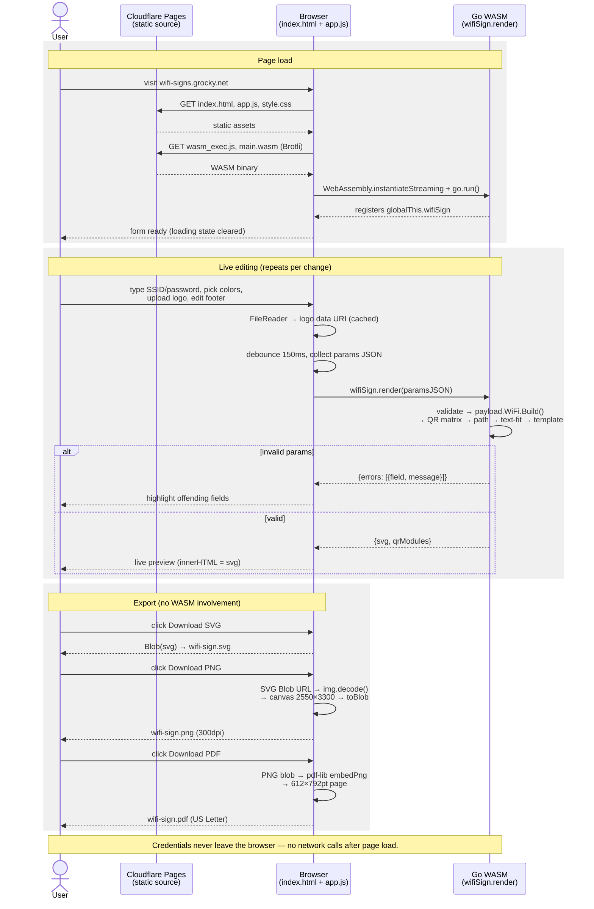

# Technical Design: Wi-Fi Sign Generator (wifi-signs.grocky.net)

**Status:** Approved for implementation
**Date:** 2026-09-02
**Author:** Rocky Gray (with Claude)

## 1. Context

`wifi-sign.svg` (project root) is a hand-designed 8.5×11in poker-club Wi-Fi sign. This project turns it into a template behind a static webapp where anyone can generate their own sign: enter Wi-Fi credentials, pick colors, upload a logo, edit the bottom text, and download a printable file.

Decisions already made:

- **Client-side via Go WASM** — the existing Go payload/QR logic compiles to WebAssembly and runs entirely in the browser. **Passwords never leave the device.**
- **Hosting:** static site + CDN (Cloudflare Pages) at `wifi-signs.grocky.net`. No backend.
- **Downloads:** SVG (vector), PNG (300dpi), PDF (US Letter).
- **Logo:** user uploads PNG/JPEG/SVG, or omits it.
- **No visible credentials on the sign** — QR-only, preserving the current design.
- **Bottom area:** footer sentence is free text; the suit ornament row is show/hide only.

## 2. Goals

- Live-preview sign editor: credentials (SSID/password/auth/hidden), accent color, background color, logo upload, headline/subtitle/footer text, suits toggle.
- All rendering logic in Go, natively testable with `go test`, shared between the webapp and the CLI.
- Reuse `internal/payload` unchanged; keep the `qr-codes` CLI working.

## 3. Non-Goals (v1)

- No backend, accounts, saved designs, or shareable URLs (URLs would leak passwords).
- No layout reflow when the logo is omitted (blank space remains).
- No structured SSID/password caption — the free-text footer covers "Network: X" use cases.
- No multiple templates, custom fonts, i18n, styled/halftone QR modules, or suit-row customization beyond show/hide.
- No TinyGo; no service worker/offline support; no no-JS fallback.

## 4. Template Facts (from SVG analysis)

Hand-authored SVG, 850×1100 viewBox (8.5×11in), ~4.3KB of markup — 92% of the 70KB file is the embedded logo PNG. Flat sibling structure, five ids:

| id | Element | Role |
|---|---|---|
| `felt` | radialGradient `#1b6f4c`→`#0a3826` | background |
| `cardShadow` | filter (feDropShadow) | QR card shadow |
| `suit-row` | `<g>` in defs, 4 vector suit paths | ornament row, placed by one `<use>` at (425,1006) |
| `club-logo` | `<image>` 300×300 at (275,72) | logo (base64 PNG) |
| `wifi-qr` | `<image>` 344×344 at (253,610) | QR (base64 PNG); quiet zone comes from the white 420×420 card rect, not the bitmap |

- Accent `#e8e2d4` appears exactly **6 times** (3 fill, 3 stroke); opacity is applied via separate attributes, so themes only swap the hex.
- Three real `<text>` elements ("WI-FI" 94px white, "SCAN TO CONNECT" 26px accent, footer 20px accent), Helvetica stack, `text-anchor="middle"` at x=425, **no wrapping** — long strings overflow without mitigation.

## 5. Architecture

### 5.1 Component diagram



### 5.2 Data flow



### 5.3 Sequence diagram



## 6. Key Design Decisions

### 6.1 QR as vector path, not raster

A `matrixWriter` implementing yeqown's `qrcode.Writer` interface captures the module grid via `Matrix.Bitmap() [][]bool` (verified present in v2.2.5 — **zero new dependencies**). Dark modules are emitted as a single `<path>` with horizontal run-length merging (`M{x} {y}h{run}v1h-{run}z`), wrapped in:

```svg
<g transform="translate(253,610) scale({344/n})" shape-rendering="crispEdges">
```

- Handles any QR version (payload length varies → n×n varies); crisp at any print size.
- Eliminates the `image-rendering="pixelated"` rasterizer-compatibility risk.
- Keeps `image/*` and yeqown's `writer/standard` out of the WASM binary.
- Quiet zone continues to come from the white card rect (unchanged).

### 6.2 WASM boundary

Go owns everything from params JSON to final SVG string. JS owns form state, preview injection, and exports. One export:

```
globalThis.wifiSign.render(paramsJSON: string) → string   // result JSON
globalThis.wifiSign.version → string

// result is exactly one of:
{ "svg": "<svg ...>", "qrModules": 33 }
{ "errors": [ { "field": "ssid", "message": "SSID is required" } ] }
```

The `//go:build js && wasm` glue wraps a pure `sign.Render(paramsJSON []byte) []byte` — all logic is natively testable, no WASM test harness needed.

### 6.3 Toolchain

Standard Go, `go.mod` bumped to `go 1.24`. Binary ~4–5MB raw, ~1.2MB after CDN Brotli; loading indicator until instantiated. Note `wasm_exec.js` lives at `$(go env GOROOT)/lib/wasm/` since Go 1.24. TinyGo rejected for v1 (reflect/JSON friction, second toolchain) but documented as the size escape hatch.

### 6.4 Exports

- **PNG:** the browser rasterizes its own SVG — Blob URL → `` → `img.decode()` → canvas 2550×3300 → `toBlob('image/png')`. `feDropShadow` and system fonts render via the browser's SVG engine; data-URI logos are same-origin so the canvas is never tainted.
- **PDF:** pdf-lib (vendored, ~200KB) embeds the 300dpi PNG on a 612×792pt page — pixel-identical to the PNG export. jsPDF+svg2pdf rejected: no `<filter>`/feDropShadow support, inconsistent letter-spacing and `<use>`.
- **Print:** `window.print()` + `@media print` stylesheet showing only the sign — a free vector "Save as PDF" escape hatch.

### 6.5 Templating

`text/template` (NOT `html/template`, whose contextual escaper mangles SVG) over `internal/sign/template.svg.tmpl`, embedded via `go:embed`. Every user string passes through `xml.EscapeText` in Go **before** template execution — the template only ever sees pre-escaped values, so a forgotten escape in the template is impossible.

Template modifications to derive `template.svg.tmpl` from `wifi-sign.svg`:

1. `<title>`/`aria-label` genericized; "SWAP ME" comments stripped.
2. 6× `#e8e2d4` → `{{.Accent}}`.
3. Felt gradient stops → `{{.FeltInner}}` / `{{.FeltOuter}}` (outer derived in Go as RGB×0.5, matching the original ratio; the form exposes one background color picker).
4. Logo `<image>` wrapped in `{{if .LogoDataURI}}`, href → `{{.LogoDataURI}}`. `preserveAspectRatio="xMidYMid meet"` already letterboxes non-square logos in the 300×300 box.
5. Text elements → `{{.Headline}}` / `{{.Subtitle}}` / `{{.FooterText}}` with computed `font-size`; footer wrapped in `{{if .FooterText}}`.
6. Suit-row defs + `<use>` wrapped in `{{if .ShowSuits}}`.
7. QR `<image>` replaced by the vector `<g>` from §6.1.

**Text overflow mitigation** — deterministic font-size shrink (not bare `textLength`, which also stretches short strings): estimated width = `runes × fontSize × k + (runes−1) × letterSpacing` (k ≈ 0.62 regular / 0.72 bold for the Helvetica stack); if it exceeds the box (headline 700, subtitle 700, footer 780 units), shrink proportionally with floors (headline ≥40, others ≥12); emit `textLength`/`lengthAdjust="spacingAndGlyphs"` only on lines that hit the floor. Form inputs also carry `maxlength`.

### 6.6 Parameters

```go
// internal/sign/params.go
type Params struct {
    // Network (payload) — validated against internal/payload contract
    SSID     string `json:"ssid"`     // required; 1..32 bytes (802.11 max)
    Password string `json:"password"` // required unless Auth=="nopass"; <=63 chars
    Auth     string `json:"auth"`     // via payload.ParseAuth: WPA|WPA2|WPA3|WEP|nopass
    Hidden   bool   `json:"hidden"`

    // Appearance
    AccentColor     string `json:"accentColor"`     // ^#[0-9a-fA-F]{6}$; default "#e8e2d4"
    BackgroundColor string `json:"backgroundColor"` // same regex; default "#1b6f4c"
    LogoDataURI     string `json:"logoDataUri"`     // "" = no logo; ^data:image/(png|jpeg|svg\+xml);base64,; <=2MiB decoded
    ShowSuits       bool   `json:"showSuits"`       // default true (JS prefills)

    // Text — the form always submits fully-resolved values; FooterText:"" hides the line
    Headline   string `json:"headline"`   // default "WI-FI"; <=24 runes
    Subtitle   string `json:"subtitle"`   // default "SCAN TO CONNECT"; <=40 runes
    FooterText string `json:"footerText"` // <=120 runes
}
```

`Validate() []FieldError` returns **all** errors at once (not first-error) so the form can mark every bad field per keystroke. Defaults are prefilled by the form and re-applied defensively in Go for empty colors/text.

## 7. Repo Layout

```
qr-codes/
├── go.mod                        # bump to go 1.24
├── Makefile                      # NEW: test, build, build-wasm, serve, deploy
├── wifi-sign.svg                 # untouched original (reference artifact)
├── docs/TDD-wifi-signs.md        # this document
├── cmd/
│   ├── qr-codes/                 # existing CLI, unchanged behavior
│   │   └── sign.go               # NEW: `qr-codes sign -ssid ... -o sign.svg` (native parity harness)
│   └── wasm/
│       └── main.go               # //go:build js && wasm — glue only
├── internal/
│   ├── payload/                  # unchanged
│   ├── encoder/  decoder/        # unchanged; NOT imported by cmd/wasm
│   └── sign/                     # NEW: pure, natively-testable core
│       ├── params.go             # Params, Validate, defaults, color derivation
│       ├── qrpath.go             # matrixWriter + bitmap→path-d + scale
│       ├── render.go             # Render(paramsJSON) → result JSON; template + text-fit
│       ├── template.svg.tmpl     # go:embed
│       ├── *_test.go
│       └── testdata/golden/*.svg
└── web/                          # deployable static site (Cloudflare Pages root)
    ├── index.html
    ├── app.js                    # form, debounce, preview, per-field errors
    ├── export.js                 # canvas PNG + pdf-lib PDF
    ├── style.css                 # incl. @media print
    ├── vendor/pdf-lib.min.js     # vendored, no CDN dependency
    ├── e2e/                      # Playwright smoke spec (own package.json)
    ├── wasm_exec.js              # copied by make build-wasm (gitignored)
    └── main.wasm                 # built artifact (gitignored)
```

Makefile essentials:

```make
build-wasm:
	GOOS=js GOARCH=wasm go build -trimpath -ldflags="-s -w" -o web/main.wasm ./cmd/wasm
	cp "$$(go env GOROOT)/lib/wasm/wasm_exec.js" web/
serve:        # local static server for web/
deploy:
	wrangler pages deploy web
```

## 8. Testing

| Layer | Approach |
|---|---|
| Params | `params_test.go`: table-driven — every rule, multi-error aggregation, defaults, color regex, data-URI whitelist + size cap |
| QR path | `qrpath_test.go`: known matrix → exact path string; scale math for n∈{21,29,33,45}; **scannability round-trip** — Wi-Fi payload → matrix → paint into `image.Gray` → decode with existing `liyue201/goqr` (test-only import) → assert exact `WIFI:` string |
| Render | `render_test.go`: golden SVGs (`-update` flag) for defaults, no-logo, custom colors, long-SSID shrink, footer hidden, suits hidden; XML well-formedness on every golden (`xml.Decoder.Token()` loop); injection test (SSID `"><script>` renders escaped) |
| WASM glue | Not unit-tested (JSON in/out only); `make build-wasm` in CI proves it compiles |
| E2E | One Playwright smoke spec: load → WASM ready → type creds → preview has headline + QR `<path` → SVG download fires |
| Manual | Pre-release checklist: Chrome/Firefox/Safari; print one physical page; phone-scan the printed QR and join the network |

## 9. Risks & Mitigations

| Risk | Mitigation |
|---|---|
| Font-metric variance across OSes breaks shrink estimates | Conservative k factor + `textLength` clamp on floor-hit lines; goldens pin the math, manual checklist pins the look |
| Uploaded SVG logo with scripts/external refs | Rendered via `<image>` (spec-inert: no scripts, no external fetches); MIME whitelist; 2MiB cap |
| Long payload → dense QR in fixed 344-unit box | Input maxlengths keep payload ≤ ~110 chars (~version 6); round-trip test guards scannability |
| `feDropShadow` fidelity during canvas rasterization | Evergreen-browser support target; shadow is decorative — degradation is cosmetic |
| Safari SVG→canvas quirks | `img.decode()` await; template's explicit `width="8.5in" height="11in"` (already present); explicit drawImage dimensions |
| WASM size (~1.2MB compressed) on slow links | `-s -w -trimpath`, CDN Brotli, loading indicator; TinyGo as documented escape hatch |
| Template drift between `wifi-sign.svg` and `template.svg.tmpl` | Original kept as untouched reference; goldens are the contract going forward |

## 10. Milestones

Each milestone ends green (`go test ./...`, `go build ./...`).

1. **M1 — Core sign package:** bump go.mod; `internal/sign` params+validation and `qrpath` with tests (incl. goqr round-trip). CLI untouched.
2. **M2 — Template rendering:** derive `template.svg.tmpl` (the 7 modification points in §6.5); `Render()` with escaping + text-fit; golden/XML/injection tests; `qr-codes sign` CLI subcommand.
3. **M3 — WASM shell + live preview:** `cmd/wasm`, Makefile targets, `index.html` + `app.js` with debounced preview and per-field errors; manual browser smoke.
4. **M4 — Exports:** SVG/PNG/PDF downloads + print stylesheet; Playwright smoke spec.
5. **M5 — Polish + deploy:** color pickers, logo upload UX, loading state, meta/favicon; Cloudflare Pages project, `make deploy`, DNS for `wifi-signs.grocky.net`; manual print/scan sign-off.
